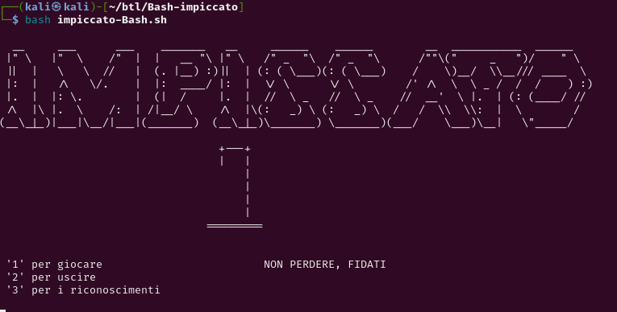
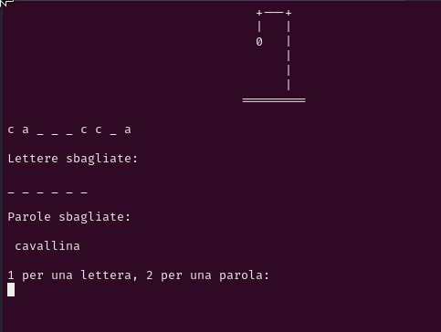

# Bash-impiccato
A simple hanged game written in bash

download the file and make it executable:

`chmod +x impiccato-Bash.sh`

Then execute the game and have fun

`./impiccato-Bash.sh`

for a better experience i suggest to zoom the terminal a little bit with:

`Ctrl + "+"`

<!-->

